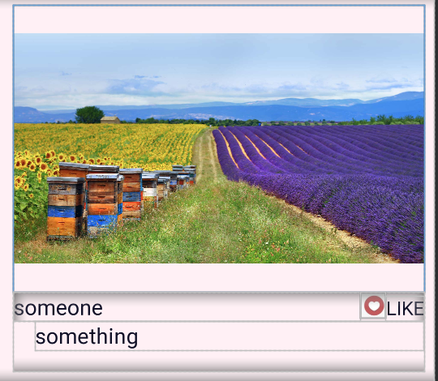
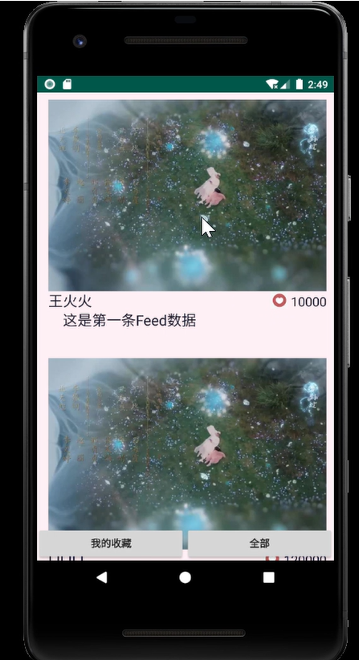
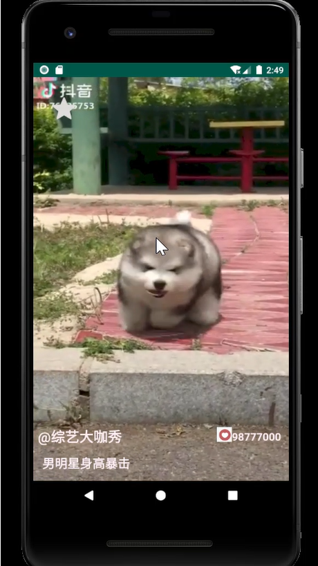

[TOC]

## 安卓大作业：短视频App开发

### 视频流列表版本

#### 实现功能

* 视频信息流列表显示（包含封面图）

* 显示每个视频基本信息：作者、简介、赞数
* 视频播放
  * 从视频信息流点击某个视频封面，进入播放页面
  * 播放相应视频
  * 单击视频窗口暂停、继续
  * 双击视频窗口点赞
* **视频收藏/查看收藏**（个人创新部分）

#### 实现过程

##### <code>VideoInfo</code> 视频信息类

* 封装了视频的所有信息：id、资源地址、作者、简介、赞数

* 利用GSON的@SerializedName注解，为网络请求得到的JSON数据提供了与JAVA对象间的映射，便于解析。

~~~java
import com.google.gson.annotations.SerializedName;
public class VideoInfo {
    @SerializedName("_id")
    public String id;
    @SerializedName("feedurl")
    public String feedUrl;
    @SerializedName("nickname")
    public String nickname;
    @SerializedName("description")
    public String description;
    @SerializedName("avatar")
    public String avatar;
    @SerializedName("likecount")
    public int likeCount;
}
~~~

##### 使用Retrofit进行网络请求

* 将<code>VideoInfo</code>作为服务器返回数据的类

* 创建用于描述网络请求的接口<code>ApiService</code>
* 在<code>MainActivity</code>中创建retrofit实例和ApiService实例，发送网络请求，获取资源

##### RecyclerView 视频流列表

* <code>MainActivity</code>的布局<code>activity_main.xml</code>中添加RecyclerView

* 创建条目布局<code>item.xml</code>来显示预览图、视频基本信息（作者、简介、点赞），效果如下图：

  

* 创建适配器VideoAdapter来创建itemview以及绑定数据

* 在MainActivity中为RecyclerView设置布局管理器、设置VideoAdapter

* 在Retrofit获取网络资源后，重新传入数据，通知VideoAdapter数据改变，刷新列表

  * Retrofit

    ~~~java
    public void onResponse(Call<List<VideoInfo>> call, Response<List<VideoInfo>> response) {
        /*略..*/
        mVideoAdapter.setData(videos);
        mVideoAdapter.notifyDataSetChanged();
        /*略..*/
    }
    ~~~

  * VideoAdapter

    ~~~java
    public void setData(List<VideoInfo> videos) {
            videoInfoList=videos;
        }
    ~~~

* 使用Glide加载封面图，设置占位图

  ~~~java
   @Override
      public void onBindViewHolder(VideoAdapter.mViewHolder holder, int position) {
  		/*略..*/
          VideoInfo video = videoInfoList.get(position);
          Glide.with(context)
                  .load(video.avatar)//加载封面图
                  .placeholder(R.mipmap.default_pre)//图片加载出来前的占位图
  	            .error(R.mipmap.error)//图片加载失败显示的占位图
                  .apply(new RequestOptions().centerCrop())
                  .into(holder.preImg);//到组件preImg上
          /*略..*/
      }
  ~~~

* 视频流列表效果如下

  

##### RecyclerView item点击事件处理——跳转视频播放页

* 在VideoAdapter中创建接口、点击item时调用

  ~~~java
  public VideoAdapter(Context context, List<VideoInfo> videoInfoList, ListItemClickListener listener) {
           /*略*/
          this.mOnClickListener = listener;
          /*略*/
      } 
   /*略*/
  public class mViewHolder extends RecyclerView.ViewHolder implements View.OnClickListener {
         /*略*/
          public mViewHolder(@NonNull View itemView) {
               /*略*/
              itemView.setOnClickListener(this);
          }
          @Override
          public void onClick(View v) {
              int clickedPosition=getAdapterPosition();
              if(mOnClickListener!=null)
              {
                  mOnClickListener.onListItemClick(clickedPosition);
              }
          }
  public interface ListItemClickListener {
          void onListItemClick (int position);
      }
  ~~~

* MainActivity实现接口

  ~~~java
  public class MainActivity extends AppCompatActivity implements VideoAdapter.ListItemClickListener {
  	/*略*/
      @Override
      public void onListItemClick(int clickedItemIndex){
          Log.d("bdc", "onListItemClick: position"+clickedItemIndex);
          VideoInfo video=isStar?starVideos.get(clickedItemIndex):videos.get(clickedItemIndex);
          
          Intent intent=new Intent(MainActivity.this,VideoActivity.class);
  		//传入所需参数
          intent.putExtra(KEY_INDEX,clickedItemIndex);
          intent.putExtra(KEY_NAME,video.nickname);
          intent.putExtra(KEY_FEED_URL,video.feedUrl);
          intent.putExtra(KEY_DESCRIPTION,video.description);
          intent.putExtra(KEY_LIKE_COUNT,video.likeCount+" ");
  
          startActivityForResult(intent,222);
      }
  }
  ~~~

##### VideoActivity 视频播放页

* 布局<code>activity_video.xml</code>,效果如图

  

* <code>GestureDetector</code> 手势监听

  使用GestureDetector进行手势监听来实现单击、双击的响应事件

  * 单击播放/暂停

  * 双击点赞

    ~~~java
     gestureDetector=new GestureDetector(this,new GestureDetector.SimpleOnGestureListener(){
                @Override/*单击播放、暂停*/
                public boolean onSingleTapConfirmed(MotionEvent e){
                    Log.d(TAG, "onSingleTapConfirmed:");
                    if(videoView.isPlaying()){
                        videoView.pause();
                        play.setVisibility(View.VISIBLE);//播放键动画显示
                        play.playAnimation();
                    }
                    else{
                        play.cancelAnimation();
                        play.setVisibility(View.GONE);//播放键动画撤销
                        videoView.start();
                    }
                    return super.onSingleTapConfirmed(e);
                }
    
                @Override/*双击点赞*/
                public boolean onDoubleTap(MotionEvent e){
                    Log.d(TAG, "onDoubleTap");
                    if(like.getProgress()==0){/*未点过赞*/
                        like.setVisibility(View.VISIBLE);//显示点赞动画
                        like.playAnimation();
                        like.addAnimatorListener(new Animator.AnimatorListener() {
                         	/*略*/
                            @Override
                            public void onAnimationEnd(Animator animation) {
                                like.setVisibility(View.GONE);//点赞动画播放完毕，设为不显示
                                like.removeAllAnimatorListeners();
                            }
                        });
                    }
                    return super.onDoubleTap(e);
                }
         
    /*对播放器videoView设置手势监听*/
     videoView.setOnTouchListener(new View.OnTouchListener() {
                @Override
                public boolean onTouch(View v, MotionEvent event) {
                    gestureDetector.onTouchEvent(event);
                    return false;
                }
            });
    ~~~

##### 视频收藏/查看收藏功能

**效果描述**

* 在播放列表可点击“我的收藏”按钮，查看收藏视频的视频流，点击“全部”，查看全部视频的视频流
* 点击视频播放页左上角的收藏键(灰色星形)，播放收藏动画（星形变为黄色），该视频被加入收藏夹

**实现思路**

* 由视频流列表Activity跳转至播放页Activity时，使用<code>startActivityforresult</code>

* 为播放页Activity的收藏组件设置点击监听，一旦点击则设置返回值（视频的index）

  ~~~java
  star.setOnClickListener(new View.OnClickListener() {
              @Override
              public void onClick(View v) {
                  star.playAnimation();//播放收藏动画
                  Intent intent_back=new Intent();
                  intent_back.putExtra(KEY_STAR,index);
                  setResult(222,intent_back);//设置返回值
              }
          });
  ~~~

  

* 重写<code>onActivityResult</code>获取播放页Activity返回的收藏视频的index，加入收藏视频的List

  ~~~java
  @Override
          protected void onActivityResult(int requestCode, int resultCode, Intent data){
              super.onActivityResult(requestCode,resultCode,data);
              if(requestCode==222) {
                  int starIndex=data.getIntExtra(KEY_STAR,-1);
                  if(starIndex!=-1)
                      starVideos.add(videos.get(starIndex));
              }
          }
  ~~~

* 设置“我的收藏”和“全部"按钮的点击监听，切换当前视频流列表的内容显示

  ~~~java
  btnTotal.setOnClickListener(new View.OnClickListener(){
              @Override
              public void onClick(View v){
                  if(isStar) {//重置RecyclerView内容
                      mVideoAdapter.setData(videos);
                      mVideoAdapter.notifyDataSetChanged();
                      isStar=false;
                  }
                  else
                      Toast.makeText(getApplicationContext(),"已为全部视频",Toast.LENGTH_LONG).show();
              }
          });
  
          btnStar.setOnClickListener(new View.OnClickListener(){
              @Override
              public void onClick(View v){
                  if(!isStar){//重置RecyclerView内容
                      mVideoAdapter.setData(starVideos);
                      mVideoAdapter.notifyDataSetChanged();
                      isStar=true;
                  }
                  else
                      Toast.makeText(getApplicationContext(),"已为收藏视频",Toast.LENGTH_LONG).show();
              }
          });
  ~~~

  

### 全屏item效果版本

#### 实现功能

* 全屏显示每个item
* 显示每个视频基本信息：作者、简介、赞数
* 视频播放
  * 自动播放相应视频
  * 单击视频窗口暂停、继续
  * 双击视频窗口点赞

#### 实现过程

**许多步骤、方法与上一版本类似，不再赘述**

##### ViewPager2+Fragment实现左右滑动切换页面

* MainActivity2的布局文件<code>activity_viewpager</code>根布局设为FremeLayout，添加ViewPager在最下层（xml中最上方），再添加其余用于显示视频信息的组件覆盖在屏幕下方
* Fragment布局文件<code>layout_fragment</code>仅放置<code>FullSreenVideoView</code>

* 构造Fragment时传递参数（视频资源地址），保证播放对应的视频

~~~java
/*MainActivity2*/
mFragmentStateAdapter=new FragmentStateAdapter(getSupportFragmentManager(),this.getLifecycle()) {
            @NonNull
            @Override
            public Fragment getItem(int position) {
                String feedUrl=videos.get(position).feedUrl;
                return MyFragment.newInstance(position,feedUrl);//传递参数
            }

            @Override
            public int getItemCount() {
                return videos.size();
            }
        };

/*MyFragment*/
 public static MyFragment newInstance(int position,String feedUrl){
        MyFragment mf=new MyFragment();
        Bundle args = new Bundle();
        args.putString(KEY_FEED_URL,feedUrl);
        args.putInt(KEY_POSITION,position);
        mf.setArguments(args);//传递参数
        return mf;
    }

public View onCreateView(@NonNull LayoutInflater inflater, @Nullable ViewGroup container, @Nullable Bundle savedInstanceState){
    Bundle args = getArguments();
    String feedUrl=args.getString(KEY_FEED_URL);
    position=args.getInt(KEY_POSITION,-1);
    /*略*/
}
~~~

##### ViewPager翻页监听

有关视频信息（作者、简介、赞数）显示的组件是置于Activity中的，每当翻页时，要更新MainActivity2中有关视频信息的组件的文本内容

~~~java
//切换页面，更新显示的视频信息（作者、简介、赞数）
        viewPager2.registerOnPageChangeCallback(new ViewPager2.OnPageChangeCallback() {
            @Override
            public void onPageSelected(int position) {
                super.onPageSelected(position);
                VideoInfo videoInfo=videos.get(position);
                String nameText="@"+videoInfo.nickname;
                name.setText(nameText);
                description.setText(videoInfo.description);
                likeCount.setText(" "+videoInfo.likeCount);
                //重置点赞动画
                like.setProgress(0);
                //加载动画可见、播放
                load.setVisibility(View.VISIBLE);
                load.playAnimation();
                //播放按钮动画
                play.setVisibility(View.GONE);
            }
        });
~~~

### 总结

#### 分工

个人独立完成

#### 创新点

* 增添了视频收藏功能，可在全部视频流列表和收藏夹列表间切换（视频流列表版本）
* 利用了Lottie动画，过渡视频加载时的空白画面、展现点赞、收藏的特效

#### 心得体会

尽力完成了作业要求中提及的功能，增加了一些个人的设计。

本次大作业，融合了本学期学过的大部分章节内容，涵盖了RecyclerView、ViewPager、自定义View，动画、网络、多媒体等等知识点。巩固了课程学习内容，也让人觉得获益颇多。

