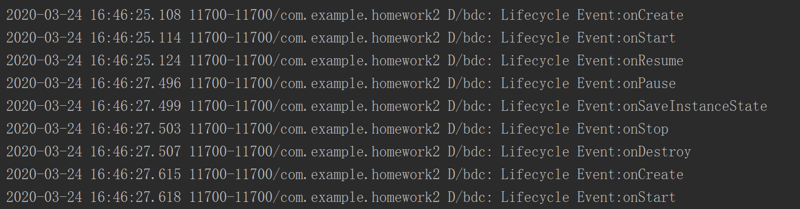
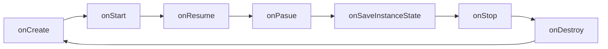
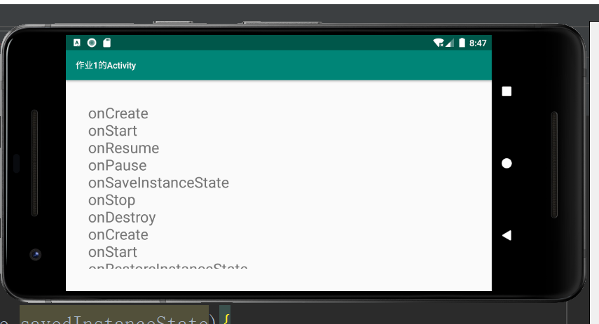

### 作业1

> Logcat在屏幕旋转的时候#onStop()、#onDestroy()会展示出来，但UI界面我们看不到，想办法补全它，让其跟logcat展示一样

查看logcat



可知，从屏幕打开到屏幕旋转后，Acitivity经历了如下历程



可知，<code>onSaveInstanceState()</code>发生在<code>onStop()</code>、<code>onDestroy()</code>之前，即只能保存下onCreate、onStart、onResume、onPause、onSaceInstanceState的记录。然而，可在onCreate时查看SavedInstance是否有内容，若有则说明经历了以上流程，在存储的SavedInstance添上onStop、onDestroy的记录，展示在指定Textview即可。

旋转屏幕后屏幕显示如下：





### 作业2

> 统计页面所有view的个数
>
> ViewGroup中的API：getChildCount() getChildAt()

#### <code>getChildCount()</code>

返回该层次（viewgroup）的子元素个数

#### <code>getChildAt(index)</code>

返回该层次下第index个子元素

#### <code>getAllChildViewCount(view)</code>

思路：Activity中的view为树结构，可通过前两个函数，对该树先序遍历得到结点数（view）个数

```java
public int getAllChildViewCount(View view) {

        //到达叶结点view
        if(!(view instanceof ViewGroup)){

            Log.d("viewid",String.valueOf(view.getId()));
            return 1;
        }

        ViewGroup vp=(ViewGroup) view;
        //不含子view
        if(vp.getChildCount()==0){
            Log.d("viewgroupid",String.valueOf(view.getId()));
            return 1;
        }

        int childNum=vp.getChildCount();
        int ViewCount=1;
        Log.d("viewgroupid",String.valueOf(view.getId()));

        for(int i=0;i<childNum;i++){
            ViewCount+=getAllChildViewCount(vp.getChildAt(i));
        }

        return ViewCount;
    }
```


### 作业3

