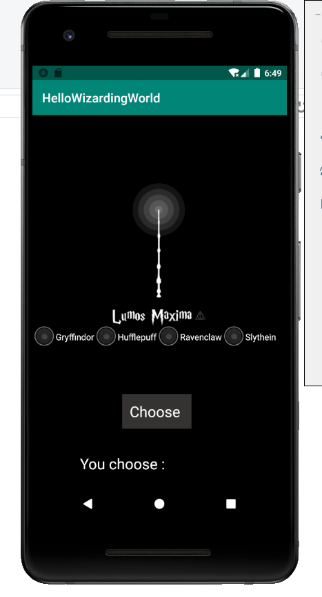
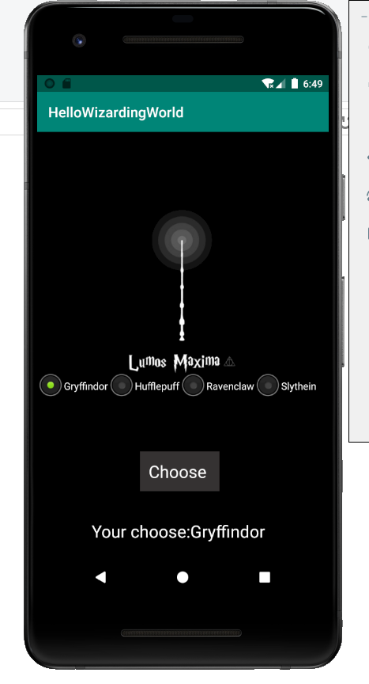
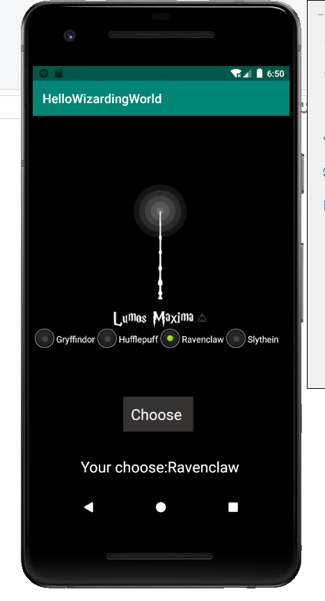
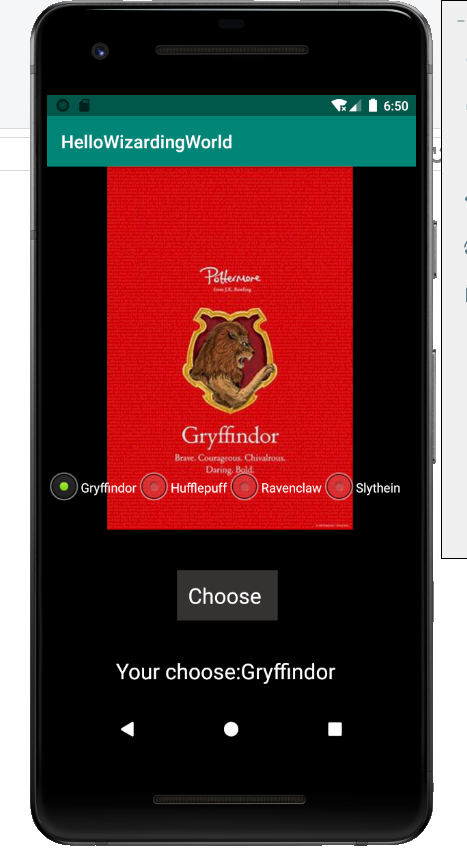
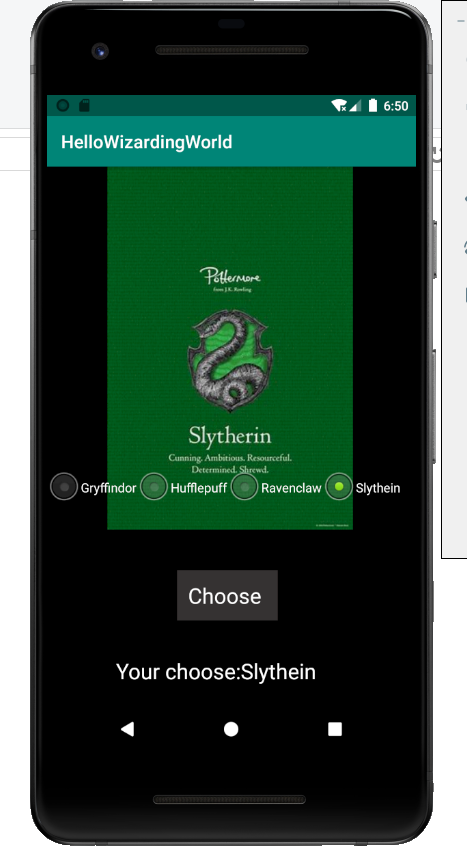

### 简介

调查霍格沃兹新入学的小巫师们的学院意向

### 预览

#### 初始页

* 正上方为魔杖图片
* 一组单选框选择学院（格兰芬多、赫奇帕奇、拉文克劳、斯莱特林）
* 选择按钮
* 文本框




#### 文本框动态显示

* 当巫师点击选中某个学院时，下方文本框显示当前选择的提示





#### 按钮

* 点击choose按钮后，显示选中学院的海报





### 日志

* 点击单选框时输出”choose“
* 点击按钮时输出”click button“
* 学院海报出现时输出该学院的名字

*截取的部分日志*

````
2020-03-21 14:50:19.244 7633-7633/com.example.helloworld D/MainActivity: choose
2020-03-21 14:50:20.987 7633-7633/com.example.helloworld D/MainActivity: click button
2020-03-21 14:50:20.998 7633-7633/com.example.helloworld D/MainActivity: Gryffindor
2020-03-21 14:50:36.822 7633-7633/com.example.helloworld D/MainActivity: choose
2020-03-21 14:50:37.281 7633-7633/com.example.helloworld D/MainActivity: click button
2020-03-21 14:50:37.295 7633-7633/com.example.helloworld D/MainActivity: Slytherin
````

